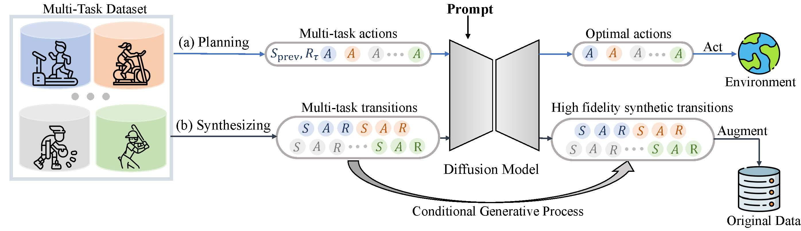
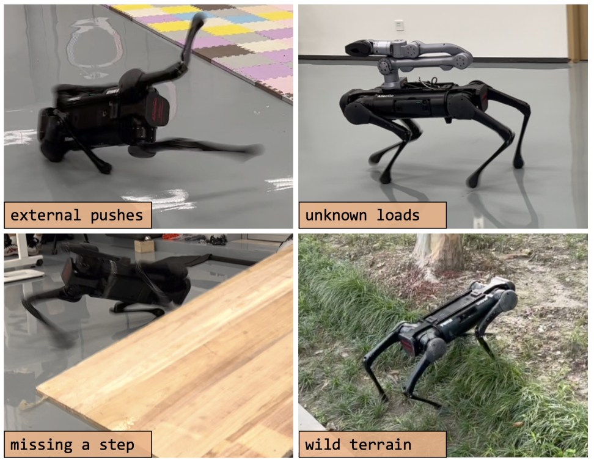
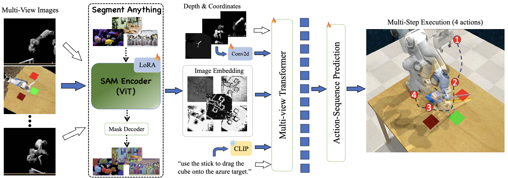
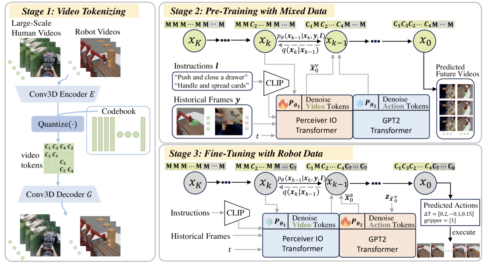
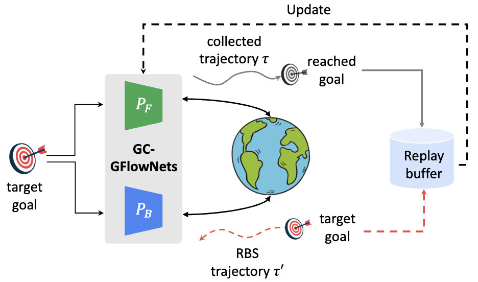
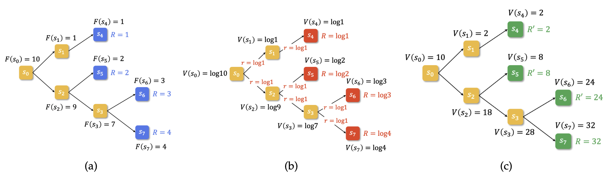
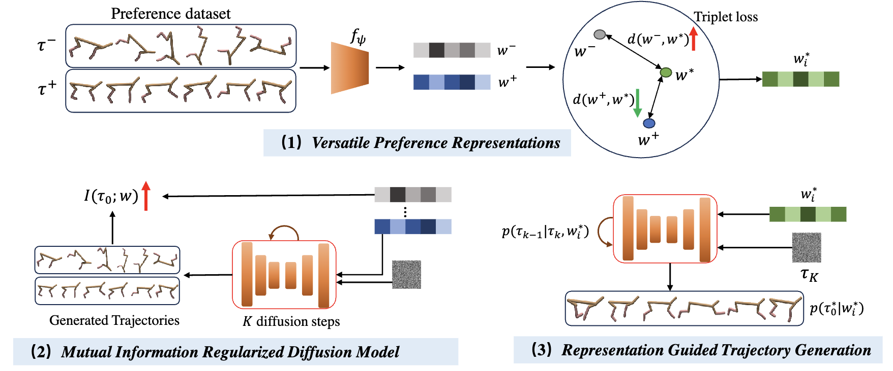
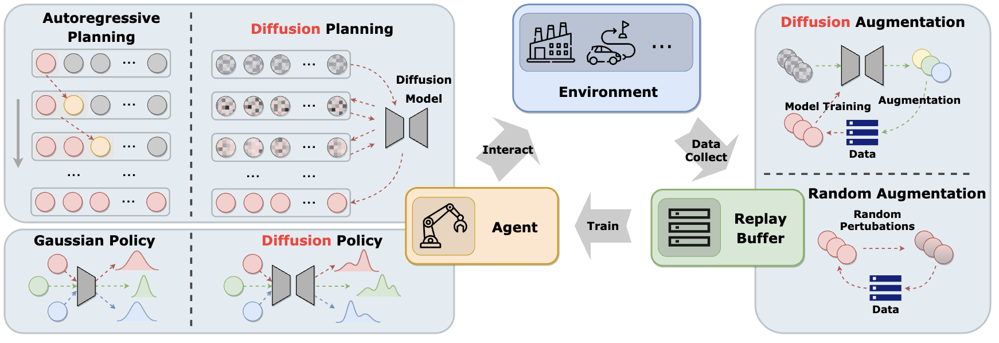
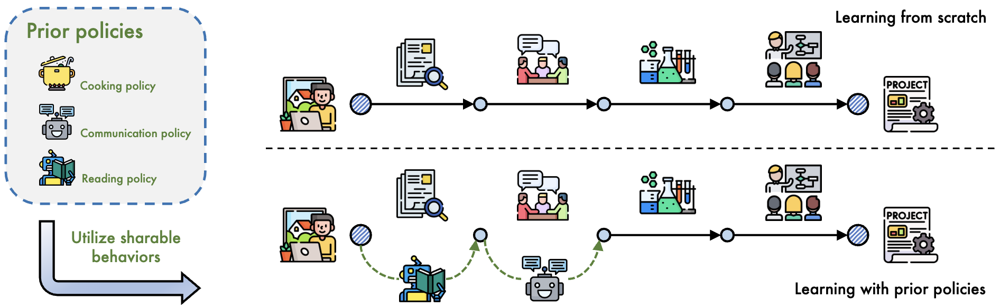



<strong><a href="https://arxiv.org/abs/2305.18459">Diffusion Model is an Effective Planner and Data Synthesizer for Multi-Task Reinforcement Learning</a></strong>

<b>Haoran He</b>, Chenjia Bai, Kang Xu, Zhuoran Yang, Weinan Zhang, Dong Wang, Bin Zhao, Xuelong Li.

<em>NeurIPS</em>, 2023 

<a href="https://arxiv.org/pdf/2305.18459">pdf</a> | <a href="https://github.com/tinnerhrhe/MTDiff">code</a>

<strong><a href="https://arxiv.org/abs/2308.09405">Robust Quadrupedal Locomotion via Risk-Averse Policy Learning </a></strong>
  
Jiyuan Shi, Chenjia Bai, <b>Haoran He</b>, Lei Han, Dong Wang, Bin Zhao, Xiu Li, Xuelong Li.

<em>ICRA</em>, 2024 

<a href="https://arxiv.org/pdf/2308.09405">pdf</a> | <a href="https://risk-averse-locomotion.github.io/">webpage</a>

<strong><a href="https://arxiv.org/abs/2405.19586">SAM-E: Leveraging Visual Foundation Model with Sequence Imitation for Embodied Manipulation</a></strong>
  
Junjie Zhang, Chenjia Bai, <b>Haoran He</b>, Wenke Xia, Zhigang Wang, Bin Zhao, Xiu Li, Xuelong Li.

<em>ICML</em>, 2024  
<a href="https://arxiv.org/pdf/2405.19586">pdf</a> | <a href="https://www.jiqizhixin.com/articles/2024-05-24-2">media</a>

<strong><a href="https://arxiv.org/abs/2402.14407">Large-Scale Actionless Video Pre-Training via Discrete Diffusion for Efficient Policy Learning </a></strong>
  
<b>Haoran He</b>, Chenjia Bai, Ling Pan, Weinan Zhang, Bin Zhao, Xuelong Li.

<em>preprint, under review</em>, 2024  
<a href="https://arxiv.org/pdf/2402.14407">pdf</a> | <a href="https://video-diff.github.io/">webpage</a> / <a href="https://www.thepaper.cn/newsDetail_forward_26690651">media</a>

<strong><a href="https://arxiv.org/abs/2406.01150">Looking Backward: Retrospective Backward Synthesis for Goal-Conditioned GFlowNets </a></strong>
  
<b>Haoran He</b>, Can Chang, Huazhe Xu, Ling Pan.
  
<em>preprint, under review</em>, 2024  
<a href="https://arxiv.org/pdf/2406.01150">pdf</a> 

<strong><a href="https://arxiv.org/abs/2406.02213">Rectifying Reinforcement Learning for Reward Matching</a></strong>
  
<b>Haoran He</b>, Emmanuel Bengio, Qingpeng Cai, Ling Pan.

<em>preprint, under review</em>, 2024  
<a href="https://arxiv.org/pdf/2406.02213">pdf</a>

<strong><a href="https://arxiv.org/abs/2305.18464">Privileged Knowledge Distillation for Sim-to-Real Policy Generalization </a></strong>
  
<b>Haoran He</b>, Chenjia Bai, Hang Lai, LingXiao Wang, Weinan Zhang.

<em>preprint, under review</em>, 2023 

<a href="https://arxiv.org/pdf/2305.18464">pdf</a> / <a href="https://github.com/tinnerhrhe/HIB_Policy">code</a>

<strong><a href="https://arxiv.org/abs/2404.04920">Regularized Conditional Diffusion Model for Multi-Task Preference Alignment </a></strong>
  
Xudong Yu, Chenjia Bai, <b>Haoran He</b>, Changhong Wang, Xuelong Li.
  
<em>preprint, under review</em>, 2023 

<a href="https://arxiv.org/pdf/2404.04920">pdf</a>

<strong><a href="https://arxiv.org/abs/2311.01223">Diffusion Models for Reinforcement Learning: A Survey</a></strong>
  
Zhengbang Zhu, Hanye Zhao, <b>Haoran He</b>, Yichao Zhong, Shenyu Zhang, Yong Yu, Weinan Zhang.

<em>preprint, under review</em>, 2023 

<a href="https://arxiv.org/pdf/2311.01223">pdf</a> | <a href="https://github.com/apexrl/diff4rlsurvey">project</a> | <a href="https://www.jiqizhixin.com/articles/2024-03-11-3">media</a>

<strong><a href="https://arxiv.org/abs/2305.17623">On the Value of Myopic Behavior in Policy Reuse</a></strong>
  
Kang Xu, Chenjia Bai, Shuang Qiu, <b>Haoran He</b>, Bin Zhao, Zhen Wang, Wei Li, Xuelong Li.

<em>preprint, under review</em>, 2023 

<a href="https://arxiv.org/pdf/2305.17623">pdf</a>

