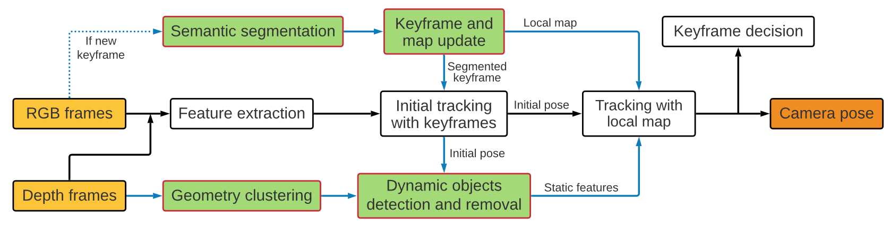

*This is the close reading of the [paper](https://ieeexplore.ieee.org/abstract/document/9561743)*

# I. Abstract

&emsp;&emsp;面向动态场景和实时性需求，作者提出一种实时语义RGB-D SLAM系统。该系统通过仅对关键帧执行语义分割来剔除已知的动态对象。对于未知动态目标，作者提出了一种几何模块，通过将深度图像聚类成几个区域并利用重投影误差识别动态区域，以达到检测未知移动物体的目的。

# II. Contributions

* 仅基于关键帧提取动态对象的语义信息并维护只包含静态特征点的地图用于tracking。
* 提出一种几何模块用于处理未知移动物体。利用K-Means方法对深度图进行聚类处理，将深度图像分割成多个区域，利用平均重投影误差来确定动态区域。直接从稀疏特征的重投影误差中识别动态区域，这使得处理速度更快，并且对动态内容更加鲁棒。
* 高精度且能够实时运行的语义SLAM系统

# III. Methods

## A. Overall framework

<figure>
    
    

    <figcaption>
    系统框图
    </figcaption>
    

</figure>

## B. Semantic Module

&emsp;&emsp;**轻量级语义分割网络SegNet用于语义分割，基于PASCAL VOC数据集对该网络进行预训练。**

&emsp;&emsp;动态物体的特征点不用于tracking和map building。

&emsp;&emsp;语义模块不对目标是否在运动进行判断，这有利于识别场景中那些暂时静态且无法通过传统的基于几何的方法检测到的对象。

## C. Geometry Module

&emsp;&emsp;语义模块仅能识别固定数目固定种类的目标，导致tracking和mapping过程会因未知移动物体存在受到影响。因此作者利用不需要先验信息的几何模块处理未知移动物体。

&emsp;&emsp;通过**K-Means**算法对深度图进行聚类处理，假设每一簇都是对象的表面，并且簇内的点具有相同的运动约束。这里作者不考虑物体是刚性的，因为一个物体的深度图在经过聚类以后可能被分成多个簇。

&emsp;&emsp;对于每一簇$$c_j$$，计算簇内所有特征点$$\mathbf{u}'_i$$和与之相对的3D空间点$$\mathbf{P}_i$$之间的平均重投影误差$$r_j$$:

$$
    \begin{aligned}
        r_j=\frac{1}{m}\sum^m_{i\in{c_j}}\rho\big(||\mathbf{u}'_i-\pi(\mathbf{T}_{wc}\mathbf{P}_i)||^2\big)
    \end{aligned}
    \tag{1}
$$

其中，$$m$$为$$c_j$$中特征点数量，$$\mathbf{T}_{wc}$$代表用李群表示的相机位姿，$$\pi$$代表相机重投影模型，$$\rho$$为惩罚函数。

&emsp;&emsp;**当某一簇的误差值相对其他簇较大时，认为该簇为动态点，并将簇内所有特征点剔除，不用于相机位姿估计**。这种几何聚类方法比对单点进行动静态判断更有效，且能够大致估计移动物体的形状。

<figure>
    
    

    <figcaption>
    动态物体检测的示例结果。第一行显示了所提出的语义模块（蓝色矩形的点）和几何模块（红色的点）检测到的动态特征。第二行是对应的语义分割结果。第三行显示深度图像的几何聚类结果，动态聚类以红色突出显示。 (a) 和 (b) 显示两个模块均检测到动态物体。 (c)-(h) 证明语义分割失败，而几何模块成功。帧取自序列 fr3/walking rpy
    </figcaption>
    

</figure>

&emsp;&emsp;上图表明，在存在大范围旋转，运动模糊和图像中仅存在动态对象的一部分的情况下，几何模块能比语义分割模块更加有效实现分割和动态特征点判定功能。但是几何模块也同时存在一定的问题，即几何模块检测到的动态运动物体有时并不完整，因为在物体的某些区域中匹配的地图点很少。这也是几何方法的局限性，难以检测运动物体的完整边界。

## D.Keyframe and Local Map Update

&emsp;&emsp;作者仅对关键帧执行语义信息提取。关键帧选择策略同ORB_SLAM2。当tracking中选择了新的关键帧时，就在单独的线程中执行语义分割并删除动态特征点。本地地图也通过删除相应的动态地图点来完成更新。

## E.Tracking

&emsp;&emsp;基于两阶段思想完成tracking。首先利用当前帧和与当前帧最近的关键帧进行初始tracking，得到一个初始估计的位姿，此时的一部分动态点已经被语义分割模块剔除，因此这里估计出来的位姿更加准确。这一初始位姿随后被用于在几何模块中计算重投影误差以检测当前帧中的动态点。在移除当前帧中的动态点后，通过跟踪当前帧中观察到的所有局部地图点，基于局部BA获得更加准确的位姿估计结果。

# IV. Reference

[1] Segnet: A deep convolutional encoder-decoder architecture for image segmentation

[2] The pascal visual object classes (voc) challenge
